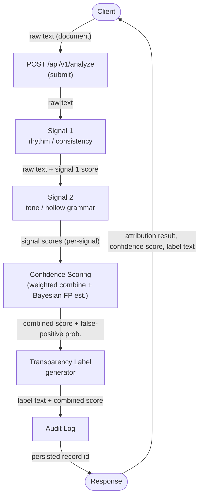
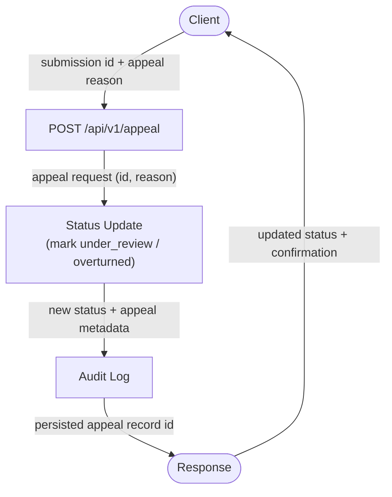

1. Build an API endpoint that takes in some document (a poem, a short story excerpt, a blog post) for attribution analysis. The endpoint must return a structured response including the attribution result, confidence score, and the transparency label text that would be shown to the user.

2.  use at least 2 distinct signals to classify content. Single-signal detection is not acceptable. The 

    - First signal, Its sentence length and complexity remain unnaturally consistent. Human writing has varying rhythm, using short, punchy statements mixed with complex clauses.
    - second signal, general risk averse tone, ai outputs tend to sound bland like a textbook 
    - third signal, Hallucinations & Flawless-Yet-Hollow Grammer: AI text is grammatically impeccable but conceptually hollow. It may confidently present "hallucinated" facts, fake citations, or missing context when pushed for detail.
    -fourth signal, personal style & anecdotes, humans draw directly from personal experiences. authentic writinug frequently includes specific names, places, dates, or subjective viewpoints that AI struggles to replicate. 


    path
    1. a piece of text goes into the system
    2. the system reads it and breaks it into meaningful chunks 
    3. the system will then compute these chunks and gives out a meaningful score that
    4. this score will be presented to the user as a confidence score with an ombre colored pallete from weak confidence being red to a little confidence being yellow to strong confidence being green
    5. the system will also provide a transparency label with this 


    False positives, this is when the system incorrectly identifies human content as AI. From this we will use a bayesian uncertainty estimator to calculate the probability of a false positive. 


---

# API Surface

Stack: Flask + flask-limiter (rate limiting) + Groq (LLM-backed signals). All
responses are JSON. Versioned under `/api/v1`.

## Endpoints

| Method | Path                  | Purpose                                              |
| ------ | --------------------- | ---------------------------------------------------- |
| POST   | `/api/v1/analyze`     | Run attribution analysis on a document (the "submit" flow) |
| POST   | `/api/v1/appeal`      | Submit an appeal contesting a prior analysis result  |
| GET    | `/api/v1/appeals`     | Reviewer-only: list the appeal queue                 |
| GET    | `/api/v1/health`      | Liveness/readiness check (no auth, not rate limited) |
| GET    | `/api/v1/signals`     | List the signals the analyzer uses + descriptions    |

> Note: the submission flow in the diagram labeled `POST /submit` maps to
> `POST /api/v1/analyze`, and `POST /appeal` maps to `POST /api/v1/appeal`.
> These are the canonical endpoint names.

---

## POST `/api/v1/analyze`

The core endpoint. Takes a document, runs the multi-signal pipeline, and returns
the attribution result, a confidence score, the transparency label, and a
per-signal breakdown.

Rate limit: e.g. `10/minute` per IP (via flask-limiter).

### Request

```http
POST /api/v1/analyze
Content-Type: application/json
```

```json
{
  "text": "The full document to analyze (poem, story excerpt, blog post).",
  "content_type": "blog_post",        // optional hint: "poem" | "short_story" | "blog_post" | "other"
  "options": {
    "include_chunk_scores": false,     // optional: return per-chunk detail
    "min_length": 50                   // optional: reject inputs shorter than this
  }
}
```

Validation:
- `text` is required, non-empty, and below a max length (e.g. 20,000 chars).
- Inputs that are too short to analyze return `422` with a clear message.

### Response — `200 OK`

```json
{
  "request_id": "a1b2c3d4",
  "attribution": {
    "label": "likely_ai",            // "likely_human" | "uncertain" | "likely_ai"
    "confidence": 0.82,               // 0.0 - 1.0, drives the ombre palette
    "confidence_band": "strong",      // "weak" | "moderate" | "strong"
    "palette_color": "#2ecc71",       // red -> yellow -> green mapped from confidence
    "false_positive_probability": 0.07 // Bayesian uncertainty estimate
  },
  "transparency_label": {
    "text": "This content shows strong indicators of AI generation.",
    "tone": "warning"                 // drives UI styling
  },
  "signals": [
    {
      "id": "rhythm_consistency",
      "name": "Sentence length & complexity variance",
      "score": 0.88,                  // 0.0 (human-like) - 1.0 (ai-like)
      "weight": 0.30,
      "explanation": "Sentence length is unnaturally uniform; lacks human burstiness."
    },
    {
      "id": "tone_blandness",
      "name": "Risk-averse / bland tone",
      "score": 0.74,
      "weight": 0.20,
      "explanation": "Reads like a textbook; avoids strong or specific stances."
    },
    {
      "id": "hollow_grammar",
      "name": "Flawless grammar / hollow content",
      "score": 0.81,
      "weight": 0.30,
      "explanation": "Grammatically impeccable but conceptually thin; possible hallucinated detail."
    },
    {
      "id": "personal_style",
      "name": "Personal style & anecdotes",
      "score": 0.79,
      "weight": 0.20,
      "explanation": "Few specific names, places, dates, or first-hand viewpoints."
    }
  ],
  "meta": {
    "chunk_count": 12,
    "model": "groq:llama-3.x",
    "analyzed_at": "2026-06-28T23:55:00Z"
  }
}
```

Notes:
- `confidence` is the aggregate of the weighted per-signal scores; signal
  `weight` values sum to 1.0.
- `palette_color` is computed from `confidence` (red → yellow → green ombre).
- `false_positive_probability` comes from the Bayesian uncertainty estimator and
  is surfaced separately so the UI can soften the label when it's high.
- `signals[].chunk_scores` is included only when `options.include_chunk_scores`
  is true.

### Error responses

```json
{ "error": { "code": "validation_error", "message": "Field 'text' is required." } }
```

| Status | `code`               | When                                          |
| ------ | -------------------- | --------------------------------------------- |
| 400    | `validation_error`   | Malformed JSON or missing/invalid fields      |
| 422    | `text_too_short`     | Input below `min_length` to analyze reliably  |
| 413    | `text_too_long`      | Input exceeds max length                      |
| 429    | `rate_limited`       | flask-limiter threshold exceeded              |
| 502    | `upstream_error`     | Groq API call failed                          |
| 500    | `internal_error`     | Unexpected server error                       |

---

## GET `/api/v1/health`

```json
{ "status": "ok", "version": "0.1.0", "groq_reachable": true }
```

## GET `/api/v1/signals`

Returns the catalogue of signals (id, name, description, default weight) so the
frontend can render explanations without hardcoding them.

```json
{
  "signals": [
    { "id": "rhythm_consistency", "name": "Sentence length & complexity variance", "weight": 0.30 },
    { "id": "tone_blandness",     "name": "Risk-averse / bland tone",               "weight": 0.20 },
    { "id": "hollow_grammar",     "name": "Flawless grammar / hollow content",      "weight": 0.30 },
    { "id": "personal_style",     "name": "Personal style & anecdotes",             "weight": 0.20 }
  ]
}
```

---

## Pipeline mapping (request → response)

1. `text` arrives at `POST /api/v1/analyze`.
2. Validate + chunk the text into meaningful units (`meta.chunk_count`).
3. Run each signal over the chunks → per-signal `score`.
4. Combine weighted scores → aggregate `confidence`.
5. Run Bayesian estimator → `false_positive_probability`.
6. Map `confidence` to `confidence_band` + ombre `palette_color`.
7. Generate `transparency_label.text` and return the structured payload.

---

## Architecture

Reference architecture for Milestones 3–5. The system exposes two flows. In the
**submission flow**, raw text posted to `/api/v1/analyze` is chunked and passed
through the detection signals, whose per-signal scores are combined and
calibrated into a single confidence score; that score drives a transparency
label, and the result is written to an audit log before being returned to the
client. In the **appeal flow**, a client contests a prior result via
`/api/v1/appeal`, the system flips that result's status to `under_review`,
records the appeal in the audit log, and returns the updated status — every
analysis and appeal is therefore traceable through the audit log.

```text
SUBMISSION FLOW
===============

  ┌────────┐  raw text   ┌──────────────────┐  raw text   ┌────────────┐
  │ Client │ ──────────▶ │ POST /api/v1/     │ ──────────▶ │  Signal 1  │
  │        │             │   analyze (submit)│             │ rhythm/    │
  └────────┘             └──────────────────┘             │ consistency│
       ▲                                                   └─────┬──────┘
       │                                      raw text +         │
       │                                   signal 1 score        ▼
       │                                                   ┌────────────┐
       │                                                   │  Signal 2  │
       │                                                   │ tone/hollow│
       │                                                   │  grammar   │
       │                                                   └─────┬──────┘
       │                                    per-signal scores    │
       │                                                         ▼
       │                                                 ┌────────────────┐
       │                                                 │   Confidence   │
       │                                                 │    Scoring     │
       │                                                 │ (combine +     │
       │                                                 │  Bayesian FP)  │
       │                                                 └───────┬────────┘
       │                              combined score +           │
       │                           false-positive prob.          ▼
       │                                                 ┌────────────────┐
       │                                                 │  Transparency  │
       │                                                 │     Label      │
       │                                                 └───────┬────────┘
       │                            label text + combined score  │
       │                                                         ▼
       │                                                 ┌────────────────┐
       │                                                 │   Audit Log    │
       │                                                 └───────┬────────┘
       │   attribution result, confidence score,                │
       │   label text                              persisted id  ▼
       │                                                 ┌────────────────┐
       └──────────────────────────────────────────────  │    Response    │
                                                         └────────────────┘


APPEAL FLOW
===========

  ┌────────┐ submission id  ┌──────────────────┐ appeal request ┌────────────┐
  │ Client │ + appeal reason│ POST /api/v1/    │ (id, reason)   │   Status   │
  │        │ ─────────────▶ │   appeal         │ ─────────────▶ │   Update   │
  └────────┘                └──────────────────┘                │(under_     │
       ▲                                                        │ review)    │
       │                                                        └─────┬──────┘
       │                                   new status +               │
       │                                appeal metadata                ▼
       │                                                        ┌────────────┐
       │                                                        │ Audit Log  │
       │                                                        └─────┬──────┘
       │     updated status + confirmation      persisted appeal id   │
       │                                                              ▼
       │                                                        ┌────────────┐
       └─────────────────────────────────────────────────────  │  Response  │
                                                                └────────────┘
```

---

# Architecture Diagram

The same two flows as rendered Mermaid (for IDE/Markdown preview). Arrows are
labeled with the data that passes between components.

## Flow 1 — Submission



## Flow 2 — Appeal



### Data passed between components

| Edge                          | Payload                                               |
| ----------------------------- | ----------------------------------------------------- |
| Client → /submit              | raw text (the document)                               |
| /submit → Signal 1            | raw text                                              |
| Signal 1 → Signal 2           | raw text + signal 1 score                             |
| Signal 2 → Confidence Scoring | per-signal signal scores                              |
| Confidence Scoring → Label    | combined score + false-positive probability           |
| Label → Audit Log             | label text + combined score                           |
| Audit Log → Response          | persisted record id                                   |
| Response → Client             | attribution result, confidence score, label text      |
| Client → /appeal              | submission id + appeal reason                          |
| /appeal → Status Update       | appeal request (id, reason)                            |
| Status Update → Audit Log     | new status + appeal metadata                           |
| Audit Log → Response          | persisted appeal record id                             |
| Response → Client             | updated status + confirmation                         |

---

# Uncertainty Representation

## What the confidence score means

`confidence` is a single value in `[0.0, 1.0]` representing **the system's
estimated probability that the text was AI-generated**. It is *not* a percentage
of the text that is AI, and *not* a raw model logit — it is a calibrated
probability.

- `confidence = 0.6` means: "Given the signals observed, we estimate a 60%
  chance this document is AI-generated." It sits in the **uncertain** band — the
  signals lean slightly toward AI but not enough to make a confident claim.
- A score near `0.5` means the signals are genuinely mixed / inconclusive.
- Scores near `0.0` or `1.0` mean the signals strongly and consistently agree.

## Mapping raw signal outputs → calibrated score

1. Each signal emits a raw score in `[0, 1]` (0 = human-like, 1 = AI-like).
2. Compute the weighted aggregate: `raw_agg = Σ(signal_score × weight)`
   (weights sum to 1.0).
3. **Calibrate** `raw_agg` into a probability using a logistic/Platt-style
   mapping fit on a small labeled validation set (known-human vs known-AI
   samples), so that a reported 0.6 actually corresponds to ~60% observed
   AI rate. Calibration parameters are stored in config, not hardcoded.
4. The Bayesian estimator adjusts for base rates and produces
   `false_positive_probability`, surfaced alongside the score so the UI can
   soften a label when uncertainty is high.

> Until enough labeled data exists to fit calibration, we ship an identity
> mapping (`confidence = raw_agg`) and clearly document it as "uncalibrated".

## Decision thresholds

| Confidence range      | Label          | Band     | Meaning                                  |
| --------------------- | -------------- | -------- | ---------------------------------------- |
| `0.00 – 0.39`         | `likely_human` | strong→moderate (low end is most human) | Signals point to human authorship |
| `0.40 – 0.59`         | `uncertain`    | weak     | Mixed / inconclusive signals             |
| `0.60 – 1.00`         | `likely_ai`    | moderate→strong | Signals point to AI generation    |

Additional guardrail: if `false_positive_probability > 0.30`, downgrade any
`likely_ai` result to `uncertain` regardless of the raw score, to bias against
falsely accusing human authors.

---

# Transparency Label Variants

The exact user-facing text for each outcome. Written before the UI so copy and
logic stay in sync. `tone` drives styling (color, icon).

### High-confidence AI (`likely_ai`, confidence ≥ 0.80)

> **Likely AI-generated.** This content shows strong, consistent indicators of
> AI generation across multiple signals. Treat attribution claims with caution
> and verify independently where it matters.

- `tone: "warning"`

### High-confidence human (`likely_human`, confidence ≤ 0.20)

> **Likely human-written.** This content shows the natural variation, voice, and
> specificity typical of human writing. No strong AI indicators were detected.

- `tone: "positive"`

### Uncertain (`uncertain`, 0.40 ≤ confidence ≤ 0.59, or high false-positive prob.)

> **Inconclusive.** The signals are mixed and we can't reliably attribute this
> content. This is an estimate, not proof — please use your own judgment and
> additional context before drawing conclusions.

- `tone: "neutral"`

> Mid-high (0.60–0.79) and mid-low (0.21–0.39) results reuse the AI / human
> copy respectively but with softened wording (e.g. "shows some indicators")
> and `tone: "caution"`.

---

# Appeals Workflow

## Who can appeal

Anyone who received an analysis result can appeal it — appeals are tied to a
prior result's `request_id`, not to an authenticated account (the system has no
user auth in v1). Each appeal is rate-limited per IP to prevent spam.

## What the appellant provides

`POST /api/v1/appeal`:

```json
{
  "request_id": "a1b2c3d4",         // the original analysis being contested
  "reason": "This is my own writing; I included personal anecdotes.",
  "claimed_origin": "human",         // "human" | "ai" | "mixed"
  "contact": "optional@email.com"    // optional, for follow-up
}
```

## What the system does on receipt

1. Validate that `request_id` exists; reject with `404 unknown_request` if not.
2. Create an appeal record with status `open`.
3. Transition the original result's status: `published → under_review`.
4. **Audit log** an `appeal_received` event: `{appeal_id, request_id, reason,
   claimed_origin, timestamp, source_ip_hash}`.
5. Return the `appeal_id` and current status to the appellant.

Status lifecycle: `open → under_review → {upheld | overturned}`. A resolution
also writes an `appeal_resolved` audit event with the reviewer's decision and
optional note.

## What a reviewer sees (appeal queue)

`GET /api/v1/appeals` returns the queue. Per item a reviewer sees:

- `appeal_id`, `request_id`, submitted timestamp, current `status`
- the **original document text** and the **original result** (label, confidence,
  per-signal scores + explanations) so they can judge the call
- the appellant's `reason` and `claimed_origin`
- `false_positive_probability` for that result (flags shaky calls)
- actions: **uphold** or **overturn**, with a required free-text note that is
  written to the audit log.

---

# Anticipated Edge Cases

Specific scenarios where the system is expected to perform poorly, and the
intended mitigation.

1. **Repetitive, simple-vocabulary poetry.** A poem built on deliberate
   repetition and short, uniform lines (e.g. a nursery-rhyme or villanelle)
   trips the *rhythm/consistency* signal — its low sentence-length variance
   reads as "unnaturally uniform" and the simple diction reads as "bland,"
   pushing it toward `likely_ai` even though it's human art.
   *Mitigation:* down-weight the rhythm signal when `content_type == "poem"`,
   and lean more on the personal-style/anecdote signal.

2. **Heavily edited / AI-assisted human writing.** A human draft run through a
   grammar tool (or lightly co-written with AI) has flawless grammar and evened-
   out rhythm but retains genuine personal anecdotes. Signals conflict, producing
   a misleadingly mid-range score that the user may over-read.
   *Mitigation:* this is exactly what the `uncertain` band + "estimate, not
   proof" label copy are for; surface per-signal disagreement to the user.

3. **Very short inputs (tweets, single stanzas, captions).** Below ~50 words
   there isn't enough text for variance-based signals to be meaningful, so any
   score is noisy.
   *Mitigation:* enforce `min_length`; return `422 text_too_short` rather than a
   confident-but-meaningless score.

4. **Technical / formulaic writing (legal, scientific abstracts, recipes).**
   Genres that are *supposed* to be dry, uniform, and impersonal will score as
   AI-like on tone and personal-style signals even when human-authored.
   *Mitigation:* note genre sensitivity in the label; consider a `content_type`
   hint to adjust expectations.

---

## AI Tool Plan

How I'll use AI code-generation tools across the three implementation
milestones. Each milestone names the **spec sections to provide as context**,
**what to ask the tool to generate**, and **how to verify** the output before
moving on.

### M3 — Submission endpoint + first signal

- **Spec to provide:** the *Detection signals* section (signal 1:
  rhythm/sentence-length consistency), the *Architecture* section
  (submission-flow diagram + narrative), and the *API Surface* request/response
  schema for `POST /api/v1/analyze`.
- **Ask the tool to generate:**
  1. A Flask app skeleton (app factory, `/api/v1/analyze` route, `/health`,
     JSON error handlers, flask-limiter wired up) matching the API surface.
  2. A standalone `signal_rhythm_consistency(text) -> float` function returning
     a `0.0–1.0` score, plus a simple chunker.
- **How I'll verify:**
  - Call `signal_rhythm_consistency()` directly on a handful of inputs (a uniform
    AI-style paragraph, a bursty human paragraph, an edge-case repetitive poem)
    **before** wiring it into the endpoint, and confirm the scores move in the
    expected direction.
  - Hit `/api/v1/analyze` with curl and check the response shape matches the
    schema (status 200, valid JSON, `signals[0].score` present).

### M4 — Second signal + confidence scoring

- **Spec to provide:** the *Detection signals* section (signal 2: tone /
  hollow-grammar), the *Uncertainty Representation* section (calibration mapping,
  weights, threshold table, false-positive guardrail), and the *Architecture*
  diagram.
- **Ask the tool to generate:**
  1. A second signal function `signal_tone_blandness(text) -> float` (and/or the
     hollow-grammar signal), same `0.0–1.0` contract.
  2. The scoring logic: weighted aggregate → calibrated `confidence` →
     `label`/`band` via the threshold table, plus the false-positive downgrade
     guardrail.
- **What I'll check:**
  - Run a small fixture set of **clearly AI** vs **clearly human** texts and
    confirm scores **vary meaningfully** between the two groups (AI cluster high,
    human cluster low) rather than bunching near 0.5.
  - Verify threshold boundaries map to the right labels (e.g. 0.39→human,
    0.55→uncertain, 0.82→ai) and that a high false-positive prob. downgrades
    `likely_ai` to `uncertain`.

### M5 — Production layer (labels + appeals)

- **Spec to provide:** the *Transparency Label Variants* section (all three exact
  texts + tone mapping), the *Appeals Workflow* section (endpoints, request body,
  status lifecycle, audit events, reviewer queue), and the *Architecture*
  appeal-flow diagram.
- **Ask the tool to generate:**
  1. Label-generation logic mapping `confidence`/`label` (+ false-positive prob.)
     to the correct transparency-label text and `tone`.
  2. The `POST /api/v1/appeal` endpoint (+ `GET /api/v1/appeals` queue), with the
     status transition `published → under_review` and audit-log writes.
- **How I'll verify:**
  - Drive inputs that land in each band and confirm **all three label variants
    (AI / human / uncertain) are reachable** and return the exact spec text.
  - Submit an appeal for a known `request_id` and confirm the original result's
    status changes to `under_review`, an `appeal_received` event is logged, and
    the appeal shows up in `GET /api/v1/appeals`.

### M6 — Ensemble detection (formalize weighting + voting)

- **Spec to provide:** the *Advanced Features → Ensemble Detection* section
  (signals/weights table, weighted-average + majority-vote methods, the
  disagreement → `uncertain` rule) and the *Uncertainty Representation* section.
- **Ask the tool to generate:**
  1. Add the 3rd and 4th signal functions (`hollow_grammar`, `personal_style`)
     with the same `0.0–1.0` contract.
  2. An `ensemble(scores, weights) -> {confidence, label, vote_ratio, agreement,
     low_agreement}` function implementing both methods and the disagreement
     guardrail; load weights/thresholds from config.
- **How I'll verify:**
  - Unit-test the ensemble on hand-built score vectors: full agreement (all high
    / all low) returns confident labels; a split vector (2 high, 2 low) forces
    `uncertain` and sets `low_agreement`.
  - Confirm `agreement` and `vote_ratio` appear in the `/api/v1/analyze` response.

### M7 — Provenance certificate ("Verified Human")

- **Spec to provide:** the *Advanced Features → Provenance Certificate* section
  (earning flow, certificate shape, display rules) and the *API Surface*.
- **Ask the tool to generate:**
  1. `POST /api/v1/verify` (issue a signed, content-hash-bound certificate) and
     `GET /api/v1/verify/{cert_id}` (public verification).
  2. Logic in `/api/v1/analyze` to attach a `provenance_certificate` block when a
     cert matches the content hash, and a `tone: "verified"` badge payload.
- **How I'll verify:**
  - Issue a cert, then analyze the same text and confirm the certificate is
    attached and the badge takes display priority over the heuristic label.
  - Tamper with the text by one character → confirm the hash no longer matches and
    the cert is **not** attached.

### M8 — Analytics dashboard

- **Spec to provide:** the *Advanced Features → Analytics Dashboard* section and
  the audit-log event names from the *Appeals Workflow* section.
- **Ask the tool to generate:**
  1. `GET /api/v1/analytics` that aggregates audit-log events over a time window
     (band distribution, appeal rate, overturn rate, FP-guardrail trigger rate).
  2. A lightweight HTML/JS page rendering those as counters + a simple chart.
- **How I'll verify:**
  - Seed a handful of analyses + appeals, then confirm the endpoint's counts match
    the seeded data and the three bands + appeal/overturn rates render correctly.

### M9 — Multi-modal support (image metadata)

- **Spec to provide:** the *Advanced Features → Multi-Modal Support* section
  (adapter layer, `AnalysisUnit`, modality table) and the *API Surface*.
- **Ask the tool to generate:**
  1. An adapter layer normalizing `text` and `image_metadata` inputs into a common
     `AnalysisUnit`.
  2. A `provenance_tags` signal that reads C2PA / "generated-by" / AI-tool EXIF
     markers as a strong AI indicator, wired into the ensemble for metadata inputs.
- **How I'll verify:**
  - Submit `content_type: "image_metadata"` with a caption + a C2PA "AI-generated"
    marker and confirm the `provenance_tags` signal fires and pushes the result
    toward `likely_ai`; submit clean metadata and confirm it does not.
  - Confirm text-mode behavior from M3–M5 is unchanged (no regression).

---

## Advanced Features

Stretch features layered on top of the core pipeline. Each is designed here so
it can be referenced as codegen context; implementation is sequenced after the
core milestones (M3–M5).

### 1. Ensemble Detection (3+ signals, documented weighting + voting)

The system already defines **four** signals; this formalizes how they combine
into one decision using *two complementary methods* that must agree.

**Signals & weights** (weights sum to 1.0):

| Signal id            | Measures                                   | Weight |
| -------------------- | ------------------------------------------ | ------ |
| `rhythm_consistency` | Sentence-length / complexity variance      | 0.30   |
| `hollow_grammar`     | Flawless-but-hollow grammar, hallucination | 0.30   |
| `tone_blandness`     | Risk-averse / textbook tone                | 0.20   |
| `personal_style`     | Personal anecdotes, names, places, dates   | 0.20   |

**Primary method — weighted average:**
`raw_agg = Σ(signal_score × weight)`, then calibrated → `confidence`
(per the *Uncertainty Representation* section).

**Cross-check method — majority vote:** each signal is binarized at its own
threshold (default 0.5) into an AI/human vote. We then compute
`vote_ratio = ai_votes / total_signals`.

**Combining the two:**
- If the weighted-average label and the majority vote **agree**, return the
  label as-is.
- If they **disagree**, force the result into the `uncertain` band and add a
  `low_agreement` flag to the response. This biases against confident calls when
  signals conflict.
- `agreement = 1 − |confidence − vote_ratio|` is surfaced as an explainability
  metric and feeds the false-positive estimate.

Weights and per-signal thresholds live in config so they can be re-tuned without
code changes.

### 2. Provenance Certificate ("Verified Human" credential)

A credential a creator can earn to assert human authorship, separate from (and
stronger than) heuristic detection.

**How it's earned (extra verification step):**

1. Creator submits the content plus a verification artifact via
   `POST /api/v1/verify` — e.g. an authenticated identity (OAuth) **and** a proof
   of authorship process (draft/revision history, or a short
   monitored writing challenge). v1 accepts identity + attested draft history.
2. The system hashes the final content (`sha256(normalized_text)`) and, if the
   verification passes, issues a **signed certificate**.

**Certificate shape (signed JWT-style token):**

```json
{
  "cert_id": "vh_9f2a…",
  "content_hash": "sha256:…",
  "subject": "creator-handle-or-id",
  "method": "identity+draft_history",
  "issued_at": "2026-06-28T23:59:00Z",
  "expires_at": null,
  "signature": "…"          // signed with server private key; verifiable via /api/v1/verify/{cert_id}
}
```

**How it's displayed on content:**
- A **"✓ Verified Human"** badge rendered next to the transparency label, in a
  distinct `tone: "verified"` style (e.g. blue/teal, not the red→green detection
  palette, so it reads as an identity claim rather than a probability).
- The badge links to a public verification page (`GET /api/v1/verify/{cert_id}`)
  showing subject, method, issue date, and the content hash it covers.
- If a certificate exists for the submitted content's hash, `/api/v1/analyze`
  includes a `provenance_certificate` block and the UI **prioritizes the badge
  over the heuristic label** (verified identity beats a guess), while still
  showing the detection result for transparency.

### 3. Analytics Dashboard

A simple read-only view aggregating data already captured in the audit log.

**Endpoint:** `GET /api/v1/analytics` returns JSON aggregates over a time window;
a lightweight HTML/JS page renders them (charts + counters).

**Metrics shown:**
- **Detection patterns** — distribution of results across the three bands
  (`likely_human` / `uncertain` / `likely_ai`) over time, plus average per-signal
  score contribution (which signals drive decisions most).
- **Appeal rate** — `appeals / total_analyses`, and the **overturn rate**
  (`overturned / resolved_appeals`) as a proxy for false-positive pain.
- **Additional metric — false-positive guardrail trigger rate:** how often the
  `false_positive_probability > 0.30` rule downgraded a `likely_ai` to
  `uncertain`. A rising rate signals the model is over-flagging humans and the
  thresholds/weights need re-tuning.

All counts derive from audit-log events (`analysis_completed`,
`appeal_received`, `appeal_resolved`), so the dashboard needs no separate store.

### 4. Multi-Modal Support (second content type)

Extend the pipeline beyond plain text to **structured content metadata** (e.g.
an image's caption/alt-text plus provenance fields) as the second modality.

**Design — modality adapters:** introduce an adapter layer that normalizes any
input into a common `AnalysisUnit { text_segments[], metadata{} }` so the
scoring core stays modality-agnostic.

| Modality    | Input                                   | Adapter behavior                                                            |
| ----------- | --------------------------------------- | -------------------------------------------------------------------------- |
| `text`      | raw document (current)                  | chunk into segments; run all four text signals                             |
| `metadata`  | `{ caption, alt_text, c2pa?, exif? }`   | run text signals on caption/alt-text; add a **provenance-tag signal** that reads C2PA / "generated by" / AI-tool EXIF markers as a strong AI indicator |

**API:** the existing `content_type` field is extended (`"text" | "image_metadata"`),
and the request carries either `text` or a `metadata` object. The response schema
is unchanged except for a `modality` field and, for metadata inputs, an extra
`provenance_tags` signal entry.

**Why metadata over raw images:** it keeps the signal philosophy (cheap,
explainable heuristics) intact and lets us treat embedded provenance markers
(C2PA/EXIF) as a high-weight signal, rather than requiring a vision model.
